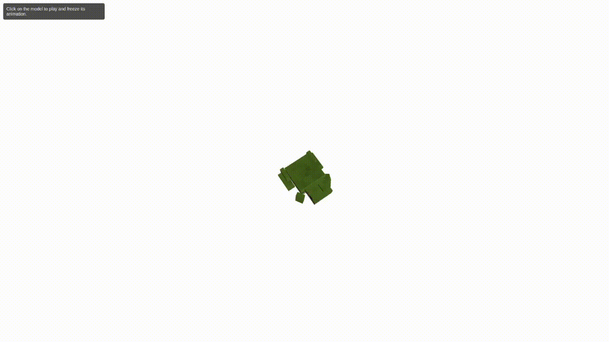

# glb-freeze

<div align="center">



  <h3 align="center">A short demo to freeze an animation of a glb object. </h3>

</div>

## Installation
```
npm install

npm run dev

npm run build
```

# Resources:

[frog model](https://sketchfab.com/3d-models/frog-jumping-fd0821c081b34c33807da145941725e8)